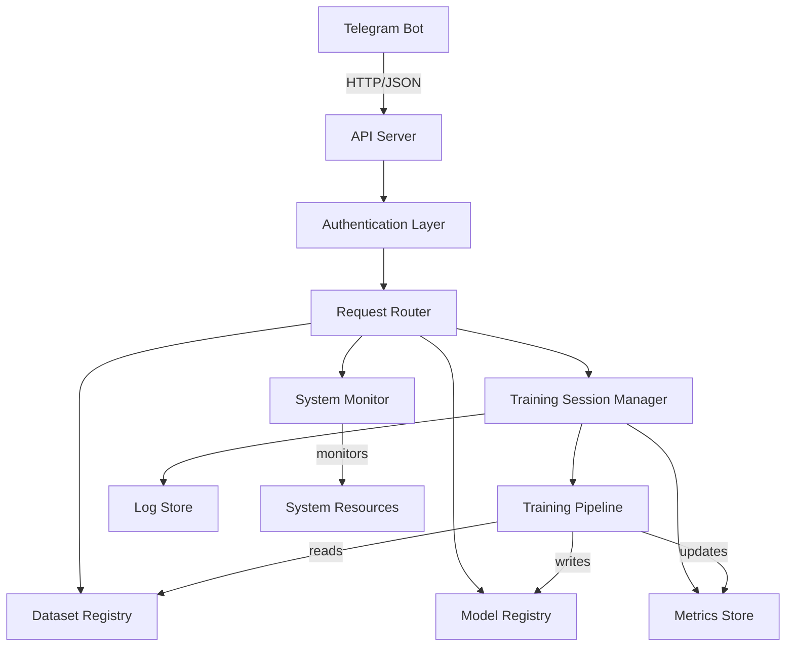

# Design Document: Server Management API

## Overview

The Server Management API is a RESTful HTTP API that provides comprehensive control over a PyTorch-based AI model training server. The API enables a Telegram bot to remotely manage training sessions, monitor system resources, manage models and datasets, and configure training parameters.

The API follows REST principles with JSON request/response format, uses API key authentication for security, and integrates with the existing PyTorch training pipeline. The design emphasizes asynchronous training execution, real-time progress monitoring, and robust error handling.

## Architecture

### High-Level Architecture



### Component Layers

1. **API Layer**: HTTP server handling requests/responses (Flask/FastAPI)
2. **Authentication Layer**: API key validation and security
3. **Business Logic Layer**: Core functionality (training, monitoring, management)
4. **Data Layer**: File system and in-memory storage for models, datasets, metrics, logs
5. **Integration Layer**: Interface with existing PyTorch training pipeline

### Technology Stack

- **API Framework**: FastAPI (async support, automatic OpenAPI docs, type validation)
- **Authentication**: API key with Bearer token
- **Training Integration**: Direct integration with existing `src/training_pipeline.py`
- **System Monitoring**: `psutil` library for CPU/memory/disk, `pynvml` for GPU
- **Storage**: File system for models/datasets, SQLite for session metadata and metrics
- **Async Execution**: `asyncio` and background tasks for training sessions

## Components and Interfaces

### 1. API Server Component

**Responsibility**: HTTP request handling, routing, and response formatting

**Interface**:
```python
class APIServer:
    def start(port: int) -> None
    def stop() -> None
    def register_routes(router: Router) -> None
```

**Endpoints**:
- `POST /api/v1/training/start` - Start new training session
- `POST /api/v1/training/{session_id}/stop` - Stop training session
- `GET /api/v1/training/{session_id}/status` - Get training status
- `GET /api/v1/training/{session_id}/metrics` - Get current metrics
- `GET /api/v1/training/{session_id}/history` - Get metrics history
- `GET /api/v1/training/{session_id}/logs` - Get training logs
- `GET /api/v1/training/sessions` - List all sessions
- `GET /api/v1/training/queue` - Get training queue status
- `DELETE /api/v1/training/queue/{session_id}` - Cancel queued session
- `GET /api/v1/system/info` - Get system resource information
- `GET /api/v1/models` - List all models
- `GET /api/v1/models/{model_name}` - Download model file
- `POST /api/v1/models` - Upload model file
- `DELETE /api/v1/models/{model_name}` - Delete model
- `GET /api/v1/datasets` - List all datasets
- `GET /api/v1/datasets/{dataset_name}` - Get dataset information
- `POST /api/v1/datasets` - Upload dataset

### 2. Authentication Component

**Responsibility**: Validate API keys and secure endpoints

**Interface**:
```python
class AuthenticationManager:
    def validate_api_key(api_key: str) -> bool
    def get_api_key_from_header(headers: dict) -> Optional[str]
    def log_auth_attempt(api_key: str, success: bool, endpoint: str) -> None
```

**Configuration**:
- API keys stored in environment variable or config file
- Support for multiple API keys (different bots/clients)
- Authentication logs stored for security auditing

### 3. Training Session Manager

**Responsibility**: Manage training lifecycle, queue, and execution

**Interface**:
```python
class TrainingSessionManager:
    def create_session(config: TrainingConfig) -> str  # Returns session_id
    def start_session(session_id: str) -> None
    def stop_session(session_id: str) -> None
    def get_status(session_id: str) -> SessionStatus
    def get_active_sessions() -> List[SessionInfo]
    def get_queued_sessions() -> List[SessionInfo]
    def cancel_queued_session(session_id: str) -> None
    def can_start_new_session() -> bool
```

**Data Structures**:
```python
class TrainingConfig:
    model_architecture: str
    dataset_name: str
    learning_rate: float
    batch_size: int
    epochs: int
    optimizer: str = "adam"
    loss_function: str = "cross_entropy"

class SessionStatus:
    session_id: str
    state: str  # "queued", "running", "completed", "failed", "stopped"
    current_epoch: Optional[int]
    total_epochs: int
    start_time: Optional[datetime]
    end_time: Optional[datetime]
    error_message: Optional[str]

class SessionInfo:
    session_id: str
    config: TrainingConfig
    status: SessionStatus
    created_at: datetime
```

**Behavior**:
- Sessions are queued if max concurrent sessions reached (default: 1)
- Each session runs in a background task (asyncio)
- Session state persisted to SQLite database
- Automatic cleanup of completed sessions after 7 days

### 4. Training Pipeline Integration

**Responsibility**: Execute training using existing PyTorch pipeline

**Interface**:
```python
class TrainingExecutor:
    def execute_training(
        session_id: str,
        config: TrainingConfig,
        metrics_callback: Callable[[Metrics], None],
        log_callback: Callable[[str], None]
    ) -> None
    
    def stop_training(session_id: str) -> None
```

**Integration Points**:
- Wraps existing `src/training_pipeline.py`
- Injects callbacks for metrics and logging
- Handles graceful shutdown on stop requests
- Saves model to `models/` directory on completion

### 5. Metrics Store

**Responsibility**: Store and retrieve training metrics

**Interface**:
```python
class MetricsStore:
    def save_metrics(session_id: str, epoch: int, metrics: Metrics) -> None
    def get_latest_metrics(session_id: str) -> Optional[Metrics]
    def get_metrics_history(session_id: str) -> List[Metrics]
    def get_metrics_by_epoch(session_id: str, epoch: int) -> Optional[Metrics]
```

**Data Structure**:
```python
class Metrics:
    session_id: str
    epoch: int
    loss: float
    accuracy: float
    val_loss: Optional[float]
    val_accuracy: Optional[float]
    timestamp: datetime
```

**Storage**: SQLite table with indexed queries on session_id and epoch

### 6. Log Store

**Responsibility**: Store and retrieve training logs

**Interface**:
```python
class LogStore:
    def append_log(session_id: str, message: str, level: str) -> None
    def get_logs(session_id: str, limit: int = 100) -> List[LogEntry]
    def get_logs_since(session_id: str, timestamp: datetime) -> List[LogEntry]
```

**Data Structure**:
```python
class LogEntry:
    session_id: str
    timestamp: datetime
    level: str  # "INFO", "WARNING", "ERROR"
    message: str
```

**Storage**: SQLite table with indexed queries on session_id and timestamp

### 7. System Monitor

**Responsibility**: Track and report system resource usage

**Interface**:
```python
class SystemMonitor:
    def get_system_info() -> SystemInfo
    def start_monitoring() -> None  # Background task
    def stop_monitoring() -> None
```

**Data Structure**:
```python
class SystemInfo:
    cpu_usage_percent: float
    memory_used_mb: float
    memory_total_mb: float
    memory_percent: float
    disk_free_gb: float
    disk_total_gb: float
    gpu_available: bool
    gpu_usage_percent: Optional[float]
    gpu_memory_used_mb: Optional[float]
    gpu_memory_total_mb: Optional[float]
    timestamp: datetime
```

**Behavior**:
- Refreshes metrics every 5 seconds in background task
- Caches latest values for fast API responses
- Uses `psutil` for CPU/memory/disk
- Uses `pynvml` (NVIDIA Management Library) for GPU metrics

### 8. Model Registry

**Responsibility**: Manage trained model files

**Interface**:
```python
class ModelRegistry:
    def list_models() -> List[ModelInfo]
    def get_model_path(model_name: str) -> Optional[Path]
    def save_model(model_name: str, file_data: bytes) -> None
    def delete_model(model_name: str) -> bool
    def model_exists(model_name: str) -> bool
```

**Data Structure**:
```python
class ModelInfo:
    name: str
    size_mb: float
    created_at: datetime
    file_path: str
```

**Storage**: 
- Models stored in `models/` directory
- Metadata indexed in SQLite for fast listing
- File naming convention: `{model_name}_{timestamp}.pth`

### 9. Dataset Registry

**Responsibility**: Manage dataset files and metadata

**Interface**:
```python
class DatasetRegistry:
    def list_datasets() -> List[DatasetInfo]
    def get_dataset_info(dataset_name: str) -> Optional[DatasetInfo]
    def save_dataset(dataset_name: str, file_data: bytes) -> None
    def dataset_exists(dataset_name: str) -> bool
```

**Data Structure**:
```python
class DatasetInfo:
    name: str
    size_mb: float
    sample_count: int
    format: str  # "csv", "images", "numpy"
    dimensions: Optional[str]
    created_at: datetime
    file_path: str
```

**Storage**:
- Datasets stored in `datasets/` directory
- Metadata indexed in SQLite
- Automatic format detection and validation

## Data Models

### Database Schema (SQLite)

**sessions table**:
```sql
CREATE TABLE sessions (
    session_id TEXT PRIMARY KEY,
    config_json TEXT NOT NULL,
    state TEXT NOT NULL,
    current_epoch INTEGER,
    total_epochs INTEGER NOT NULL,
    start_time TIMESTAMP,
    end_time TIMESTAMP,
    error_message TEXT,
    created_at TIMESTAMP NOT NULL
);
```

**metrics table**:
```sql
CREATE TABLE metrics (
    id INTEGER PRIMARY KEY AUTOINCREMENT,
    session_id TEXT NOT NULL,
    epoch INTEGER NOT NULL,
    loss REAL NOT NULL,
    accuracy REAL NOT NULL,
    val_loss REAL,
    val_accuracy REAL,
    timestamp TIMESTAMP NOT NULL,
    FOREIGN KEY (session_id) REFERENCES sessions(session_id),
    UNIQUE(session_id, epoch)
);
CREATE INDEX idx_metrics_session ON metrics(session_id);
```

**logs table**:
```sql
CREATE TABLE logs (
    id INTEGER PRIMARY KEY AUTOINCREMENT,
    session_id TEXT NOT NULL,
    timestamp TIMESTAMP NOT NULL,
    level TEXT NOT NULL,
    message TEXT NOT NULL,
    FOREIGN KEY (session_id) REFERENCES sessions(session_id)
);
CREATE INDEX idx_logs_session ON logs(session_id);
CREATE INDEX idx_logs_timestamp ON logs(timestamp);
```

**models table**:
```sql
CREATE TABLE models (
    name TEXT PRIMARY KEY,
    size_mb REAL NOT NULL,
    file_path TEXT NOT NULL,
    created_at TIMESTAMP NOT NULL
);
```

**datasets table**:
```sql
CREATE TABLE datasets (
    name TEXT PRIMARY KEY,
    size_mb REAL NOT NULL,
    sample_count INTEGER NOT NULL,
    format TEXT NOT NULL,
    dimensions TEXT,
    file_path TEXT NOT NULL,
    created_at TIMESTAMP NOT NULL
);
```

**auth_logs table**:
```sql
CREATE TABLE auth_logs (
    id INTEGER PRIMARY KEY AUTOINCREMENT,
    api_key_hash TEXT NOT NULL,
    success BOOLEAN NOT NULL,
    endpoint TEXT NOT NULL,
    timestamp TIMESTAMP NOT NULL
);
CREATE INDEX idx_auth_timestamp ON auth_logs(timestamp);
```

### API Request/Response Formats

**Start Training Request**:
```json
{
    "model_architecture": "resnet50",
    "dataset_name": "cifar10",
    "learning_rate": 0.001,
    "batch_size": 32,
    "epochs": 10,
    "optimizer": "adam",
    "loss_function": "cross_entropy"
}
```

**Start Training Response**:
```json
{
    "session_id": "sess_abc123",
    "status": "queued",
    "message": "Training session created and queued"
}
```

**Training Status Response**:
```json
{
    "session_id": "sess_abc123",
    "state": "running",
    "current_epoch": 5,
    "total_epochs": 10,
    "start_time": "2024-01-15T10:30:00Z",
    "config": {
        "model_architecture": "resnet50",
        "dataset_name": "cifar10",
        "learning_rate": 0.001,
        "batch_size": 32,
        "epochs": 10
    }
}
```

**Metrics Response**:
```json
{
    "session_id": "sess_abc123",
    "epoch": 5,
    "loss": 0.234,
    "accuracy": 0.892,
    "val_loss": 0.267,
    "val_accuracy": 0.875,
    "timestamp": "2024-01-15T10:35:00Z"
}
```

**System Info Response**:
```json
{
    "cpu_usage_percent": 45.2,
    "memory_used_mb": 8192,
    "memory_total_mb": 16384,
    "memory_percent": 50.0,
    "disk_free_gb": 250.5,
    "disk_total_gb": 500.0,
    "gpu_available": true,
    "gpu_usage_percent": 78.5,
    "gpu_memory_used_mb": 6144,
    "gpu_memory_total_mb": 8192,
    "timestamp": "2024-01-15T10:35:00Z"
}
```

**Error Response**:
```json
{
    "error": {
        "code": "INVALID_CONFIG",
        "message": "Learning rate must be between 0.0001 and 1.0",
        "details": {
            "field": "learning_rate",
            "value": 5.0
        }
    }
}
```


## Correctness Properties

A property is a characteristic or behavior that should hold true across all valid executions of a system—essentially, a formal statement about what the system should do. Properties serve as the bridge between human-readable specifications and machine-verifiable correctness guarantees.

### Training Session Properties

**Property 1: Valid training configuration creates session**
*For any* valid training configuration (with valid model architecture, dataset name, learning rate, batch size, and epochs), starting a training session should create a new session with a unique session ID and either start execution or queue it.
**Validates: Requirements 1.1, 6.1, 6.2, 6.3**

**Property 2: Stopping active session preserves state**
*For any* active training session, stopping it should gracefully terminate execution, save the current model state, and update the session status to "stopped".
**Validates: Requirements 1.2**

**Property 3: Session status reflects actual state**
*For any* training session in any state (queued, running, completed, failed, stopped), querying its status should return the correct current state.
**Validates: Requirements 1.3**

**Property 4: Completed session saves model**
*For any* training session that completes successfully, the final model file should exist in the model registry and the session status should be "completed".
**Validates: Requirements 1.4**

**Property 5: Failed session logs error**
*For any* training session that fails, the session should have status "failed", an error message should be present, and the error should be logged.
**Validates: Requirements 1.5**

### Metrics Properties

**Property 6: Active session provides current metrics**
*For any* active training session, requesting metrics should return data containing the current epoch number, loss, and accuracy.
**Validates: Requirements 2.1**

**Property 7: Metrics request returns latest data**
*For any* training session with recorded metrics, requesting metrics should return the entry with the highest epoch number.
**Validates: Requirements 2.2**

**Property 8: Metrics history returns all epochs**
*For any* training session with N recorded metric entries, requesting metrics history should return all N entries in chronological order.
**Validates: Requirements 2.3**

**Property 9: Metrics recorded per epoch**
*For any* training session that completes E epochs, the metrics history should contain exactly E metric entries (one per epoch).
**Validates: Requirements 2.4**

**Property 10: Non-existent session returns error**
*For any* randomly generated session ID that doesn't exist, requesting metrics should return a 404 error with an appropriate message.
**Validates: Requirements 2.5**

### System Monitoring Properties

**Property 11: System info contains required fields**
*For any* system info request, the response should contain CPU usage, memory usage (MB and percent), disk space (free and total), and GPU information (if available).
**Validates: Requirements 3.1, 3.2, 3.3, 3.4**

### Model Management Properties

**Property 12: Model list returns all models**
*For any* set of N models in the model registry, listing models should return exactly N entries with complete information (name, size, creation date).
**Validates: Requirements 4.1**

**Property 13: Model download round-trip**
*For any* model file uploaded to the registry, downloading it by name should return file data identical to the original upload.
**Validates: Requirements 4.2, 4.3**

**Property 14: Model deletion removes all traces**
*For any* existing model in the registry, deleting it should remove both the database entry and the file from the filesystem, and subsequent operations on that model should return 404 errors.
**Validates: Requirements 4.4**

**Property 15: Non-existent resource returns 404**
*For any* randomly generated resource name (model or dataset) that doesn't exist, operations on that resource should return a 404 error with an appropriate message.
**Validates: Requirements 4.5, 5.4**

### Dataset Management Properties

**Property 16: Dataset list returns complete metadata**
*For any* set of N datasets in the registry, listing datasets should return exactly N entries with complete metadata (name, size, sample count, format, dimensions, creation date).
**Validates: Requirements 5.1**

**Property 17: Dataset info returns correct metadata**
*For any* dataset in the registry, requesting its information should return metadata that matches the dataset's actual properties (format, dimensions, sample count).
**Validates: Requirements 5.2**

**Property 18: Dataset upload stores with metadata**
*For any* valid dataset file uploaded, it should be stored in the registry with correctly extracted metadata (size, format, sample count).
**Validates: Requirements 5.3**

### Configuration Properties

**Property 19: Invalid configuration rejected with validation errors**
*For any* training configuration with invalid parameters (e.g., negative learning rate, zero batch size, non-existent dataset), the start request should be rejected with a 400 error containing specific validation error messages.
**Validates: Requirements 6.4**

**Property 20: Optional parameters use defaults**
*For any* training configuration with optional parameters omitted (optimizer, loss function), the created session should use the documented default values.
**Validates: Requirements 6.5**

### Logging Properties

**Property 21: Session logs are retrievable**
*For any* training session with N log entries, requesting logs should return all N entries with timestamps and messages.
**Validates: Requirements 7.1**

**Property 22: Training history returns all sessions**
*For any* set of M completed training sessions, requesting training history should return all M sessions with their final status.
**Validates: Requirements 7.2**

**Property 23: Active session appends logs**
*For any* active training session, new log entries should be appended in real-time and be retrievable immediately.
**Validates: Requirements 7.3**

**Property 24: Completed session persists logs**
*For any* training session that completes or fails, all log entries should remain retrievable after the session ends.
**Validates: Requirements 7.4**

**Property 25: All log entries have timestamps**
*For any* log entry in any session, it should contain a valid timestamp in ISO 8601 format.
**Validates: Requirements 7.5**

### Authentication Properties

**Property 26: Unauthenticated requests rejected**
*For any* API endpoint, making a request without a valid API key should return a 401 Unauthorized error.
**Validates: Requirements 8.1**

**Property 27: Authenticated requests processed**
*For any* API endpoint, making a request with a valid API key should process the request normally (not return 401).
**Validates: Requirements 8.2**

**Property 28: Invalid API key returns auth error**
*For any* randomly generated invalid API key, requests using it should return a 401 error with an authentication error message.
**Validates: Requirements 8.4**

**Property 29: Authentication attempts logged**
*For any* authentication attempt (valid or invalid), an entry should be created in the authentication log with the timestamp, endpoint, and success status.
**Validates: Requirements 8.5**

### API Response Properties

**Property 30: All responses are valid JSON**
*For any* API endpoint and any request (valid or invalid), the response body should be valid JSON that can be parsed.
**Validates: Requirements 9.1**

**Property 31: HTTP status codes match operation result**
*For any* API operation, the HTTP status code should be 200 for success, 4xx for client errors, and 5xx for server errors.
**Validates: Requirements 9.2, 9.3, 9.4**

**Property 32: Error responses have consistent structure**
*For any* error response (4xx or 5xx), the JSON body should contain an "error" object with "code" and "message" fields.
**Validates: Requirements 9.5**

### Concurrent Training Properties

**Property 33: Concurrent sessions run when resources allow**
*For any* system with capacity for N concurrent sessions, submitting N training requests should result in all N running concurrently (not queued).
**Validates: Requirements 10.1**

**Property 34: Requests queued when capacity full**
*For any* system at maximum capacity, submitting a new training request should add it to the queue with status "queued".
**Validates: Requirements 10.2**

**Property 35: Queue status returns all queued sessions**
*For any* set of Q queued training sessions, requesting queue status should return exactly Q sessions with their configurations.
**Validates: Requirements 10.3**

**Property 36: Queue automatically processes on completion**
*For any* system with a queued session, when an active session completes and resources become available, the next queued session should automatically start.
**Validates: Requirements 10.4**

**Property 37: Canceling queued session removes it**
*For any* queued training session, canceling it should remove it from the queue, and subsequent queue status requests should not include it.
**Validates: Requirements 10.5**

## Error Handling

### Error Categories

1. **Authentication Errors (401)**
   - Missing API key
   - Invalid API key
   - Expired API key

2. **Validation Errors (400)**
   - Invalid training configuration parameters
   - Missing required fields
   - Invalid data types
   - Out-of-range values

3. **Not Found Errors (404)**
   - Non-existent session ID
   - Non-existent model name
   - Non-existent dataset name

4. **Conflict Errors (409)**
   - Model name already exists
   - Dataset name already exists
   - Cannot stop non-active session

5. **Server Errors (500)**
   - Database connection failure
   - File system errors
   - Training pipeline crashes
   - Unexpected exceptions

### Error Response Format

All errors follow a consistent structure:

```json
{
    "error": {
        "code": "ERROR_CODE",
        "message": "Human-readable error description",
        "details": {
            "field": "optional_field_name",
            "value": "optional_invalid_value"
        }
    }
}
```

### Error Handling Strategies

1. **Graceful Degradation**: If GPU monitoring fails, continue with CPU/memory monitoring
2. **Automatic Retry**: Database operations retry up to 3 times with exponential backoff
3. **Resource Cleanup**: Failed training sessions clean up partial model files
4. **Detailed Logging**: All errors logged with full stack traces for debugging
5. **User-Friendly Messages**: Error messages are clear and actionable

### Training Failure Handling

When a training session fails:
1. Catch exception and log full stack trace
2. Update session status to "failed" with error message
3. Save partial model if any epochs completed
4. Clean up temporary files
5. Release resources for next queued session
6. Notify via API response and logs

## Testing Strategy

### Dual Testing Approach

The API will be validated using both unit tests and property-based tests:

- **Unit tests**: Verify specific examples, edge cases, and error conditions
- **Property tests**: Verify universal properties across all inputs

Both approaches are complementary and necessary for comprehensive coverage. Unit tests catch concrete bugs in specific scenarios, while property tests verify general correctness across a wide range of inputs.

### Property-Based Testing

**Library**: `hypothesis` (Python property-based testing library)

**Configuration**:
- Minimum 100 iterations per property test
- Each test tagged with comment referencing design property
- Tag format: `# Feature: server-management-api, Property N: [property text]`

**Test Organization**:
- Each correctness property implemented as a single property-based test
- Tests organized by component (training, metrics, models, datasets, auth)
- Shared generators for common data types (configs, session IDs, model names)

**Example Property Test**:
```python
from hypothesis import given, strategies as st

@given(
    model_arch=st.sampled_from(["resnet50", "vgg16", "mobilenet"]),
    dataset=st.sampled_from(["cifar10", "mnist", "imagenet"]),
    lr=st.floats(min_value=0.0001, max_value=1.0),
    batch_size=st.integers(min_value=1, max_value=256),
    epochs=st.integers(min_value=1, max_value=100)
)
def test_valid_config_creates_session(model_arch, dataset, lr, batch_size, epochs):
    """
    Feature: server-management-api, Property 1: Valid training configuration creates session
    """
    config = {
        "model_architecture": model_arch,
        "dataset_name": dataset,
        "learning_rate": lr,
        "batch_size": batch_size,
        "epochs": epochs
    }
    response = api_client.post("/api/v1/training/start", json=config)
    assert response.status_code == 200
    assert "session_id" in response.json()
    assert response.json()["status"] in ["queued", "running"]
```

### Unit Testing

**Framework**: `pytest`

**Coverage Areas**:
- Specific examples of valid configurations
- Edge cases (empty datasets, single epoch, maximum batch size)
- Error conditions (invalid auth, missing fields, non-existent resources)
- Integration between components
- Database operations
- File system operations

**Test Organization**:
- `tests/unit/test_training_manager.py`
- `tests/unit/test_metrics_store.py`
- `tests/unit/test_model_registry.py`
- `tests/unit/test_dataset_registry.py`
- `tests/unit/test_auth.py`
- `tests/unit/test_system_monitor.py`
- `tests/integration/test_api_endpoints.py`

### Integration Testing

**Scope**: End-to-end API workflows
- Complete training session lifecycle (start → monitor → complete)
- Model upload → train → download workflow
- Authentication → operation → logging workflow
- Queue management (fill capacity → queue → auto-start)

**Test Environment**:
- Isolated test database (SQLite in-memory)
- Temporary file system for models/datasets
- Mock training pipeline for fast execution
- Test API keys

### Performance Testing

**Metrics to Track**:
- API response time (target: < 100ms for most endpoints)
- Concurrent session capacity
- Database query performance
- File upload/download speed
- Memory usage during training

**Tools**: `locust` for load testing, `pytest-benchmark` for micro-benchmarks

### Test Data Generators

**Hypothesis Strategies**:
```python
# Training configuration generator
training_config = st.fixed_dictionaries({
    "model_architecture": st.sampled_from(VALID_MODELS),
    "dataset_name": st.sampled_from(VALID_DATASETS),
    "learning_rate": st.floats(min_value=0.0001, max_value=1.0),
    "batch_size": st.integers(min_value=1, max_value=256),
    "epochs": st.integers(min_value=1, max_value=100),
    "optimizer": st.sampled_from(["adam", "sgd", "rmsprop"]),
    "loss_function": st.sampled_from(["cross_entropy", "mse"])
})

# Invalid configuration generator (for error testing)
invalid_config = st.one_of(
    st.fixed_dictionaries({...}),  # Missing required fields
    st.fixed_dictionaries({...}),  # Invalid value ranges
    st.fixed_dictionaries({...})   # Invalid types
)

# Session ID generator
session_id = st.text(
    alphabet=st.characters(whitelist_categories=("Lu", "Ll", "Nd")),
    min_size=10,
    max_size=20
).map(lambda s: f"sess_{s}")

# Model name generator
model_name = st.text(
    alphabet=st.characters(whitelist_categories=("Lu", "Ll", "Nd", "P")),
    min_size=1,
    max_size=50
).filter(lambda s: s.strip() and not s.startswith("."))
```

### Continuous Integration

**CI Pipeline**:
1. Run unit tests (fast feedback)
2. Run property tests with 100 iterations
3. Run integration tests
4. Generate coverage report (target: > 80%)
5. Run linting and type checking (mypy)
6. Build API documentation

**Tools**: GitHub Actions, pytest, coverage.py, mypy, black, flake8
