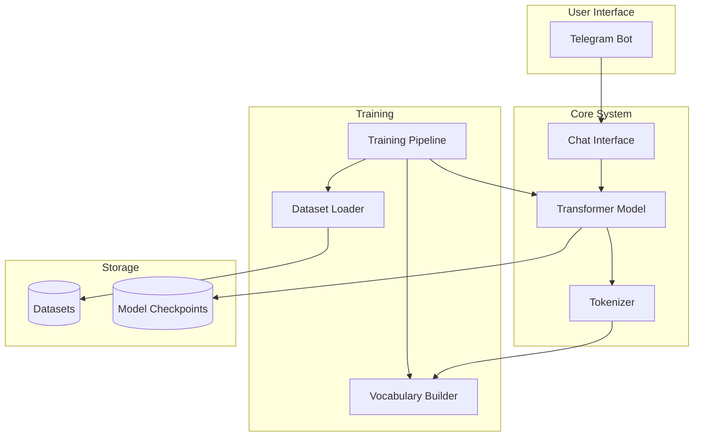
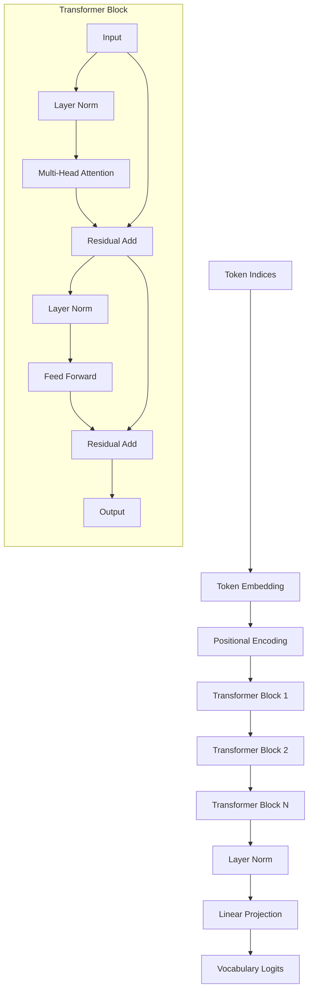
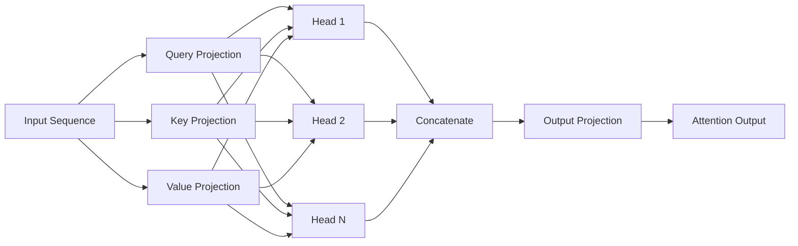

# Design Document: Transformer Architecture Upgrade

## Overview

This design document describes the architecture and implementation approach for upgrading the AI chatbot from a character-level LSTM to a Transformer decoder architecture. The upgrade focuses on improving text generation quality while maintaining compatibility with existing infrastructure.

### Key Design Decisions

1. **Decoder-Only Architecture**: We'll implement a GPT-style decoder-only Transformer, which is well-suited for autoregressive text generation
2. **Subword Tokenization**: Upgrade from character-level to BPE tokenization for better semantic understanding
3. **Modular Design**: Keep the same module boundaries (Model, Training_Pipeline, Dataset_Loader) to minimize integration changes
4. **Backward Compatibility**: Maintain the same public interfaces so the Telegram bot requires no modifications
5. **Configurable Architecture**: Support multiple model sizes (small, medium, large) through configuration

### Architecture Comparison

**Current LSTM Architecture:**
- Character-level tokenization
- 2-layer LSTM with 256 hidden dimensions
- Simple embedding → LSTM → linear projection
- Limited context window (sequence length ~100)

**New Transformer Architecture:**
- BPE subword tokenization
- Multi-layer Transformer decoder with self-attention
- Positional encoding + multi-head attention + feed-forward networks
- Larger context window (512-2048 tokens)
- Better long-range dependency modeling

## Architecture

### System Architecture

The system maintains the same high-level architecture with enhanced components:



### Transformer Model Architecture

The Transformer decoder consists of stacked decoder blocks with the following structure:



### Multi-Head Attention Mechanism



## Components and Interfaces

### 1. TransformerModel Class

**Purpose**: Main model class implementing the Transformer decoder architecture.

**Interface**:
```python
class TransformerModel(nn.Module):
    def __init__(
        self,
        vocab_size: int,
        embedding_dim: int,
        num_heads: int,
        num_layers: int,
        hidden_dim: int,
        max_seq_length: int,
        dropout: float = 0.1
    ):
        """Initialize Transformer model with configuration."""
        
    def forward(
        self,
        input_ids: torch.Tensor,
        attention_mask: Optional[torch.Tensor] = None
    ) -> torch.Tensor:
        """
        Forward pass through the Transformer.
        
        Args:
            input_ids: Token indices [batch_size, seq_len]
            attention_mask: Optional mask [batch_size, seq_len]
            
        Returns:
            logits: Predictions [batch_size, seq_len, vocab_size]
        """
        
    def generate(
        self,
        seed_text: str,
        max_length: int,
        temperature: float = 1.0,
        top_k: int = 50,
        top_p: float = 0.9,
        repetition_penalty: float = 1.0
    ) -> str:
        """Generate text using various sampling strategies."""
        
    def set_tokenizer(self, tokenizer: Tokenizer) -> None:
        """Set the tokenizer for encoding/decoding."""
        
    def save_weights(self, filepath: str) -> None:
        """Save model checkpoint with config and tokenizer."""
        
    def load_weights(self, filepath: str) -> None:
        """Load model checkpoint."""
```

**Key Responsibilities**:
- Implement Transformer decoder forward pass
- Manage token embeddings and positional encodings
- Apply causal masking for autoregressive generation
- Provide text generation with multiple sampling strategies
- Handle model serialization and deserialization

### 2. TransformerBlock Class

**Purpose**: Single Transformer decoder block with self-attention and feed-forward layers.

**Interface**:
```python
class TransformerBlock(nn.Module):
    def __init__(
        self,
        embedding_dim: int,
        num_heads: int,
        hidden_dim: int,
        dropout: float = 0.1
    ):
        """Initialize a Transformer block."""
        
    def forward(
        self,
        x: torch.Tensor,
        attention_mask: Optional[torch.Tensor] = None
    ) -> torch.Tensor:
        """
        Forward pass through the block.
        
        Args:
            x: Input tensor [batch_size, seq_len, embedding_dim]
            attention_mask: Causal mask [seq_len, seq_len]
            
        Returns:
            output: Transformed tensor [batch_size, seq_len, embedding_dim]
        """
```

**Components**:
- Multi-head self-attention layer
- Layer normalization (pre-norm architecture)
- Feed-forward network (2-layer MLP)
- Residual connections
- Dropout for regularization

### 3. MultiHeadAttention Class

**Purpose**: Implement scaled dot-product attention with multiple heads.

**Interface**:
```python
class MultiHeadAttention(nn.Module):
    def __init__(
        self,
        embedding_dim: int,
        num_heads: int,
        dropout: float = 0.1
    ):
        """Initialize multi-head attention."""
        
    def forward(
        self,
        x: torch.Tensor,
        attention_mask: Optional[torch.Tensor] = None
    ) -> torch.Tensor:
        """
        Compute multi-head self-attention.
        
        Args:
            x: Input [batch_size, seq_len, embedding_dim]
            attention_mask: Causal mask [seq_len, seq_len]
            
        Returns:
            output: Attention output [batch_size, seq_len, embedding_dim]
        """
```

**Algorithm**:
1. Project input to Q, K, V for each head
2. Compute scaled dot-product attention: softmax(QK^T / sqrt(d_k))V
3. Apply causal mask to prevent attending to future positions
4. Concatenate heads and project to output dimension

### 4. PositionalEncoding Class

**Purpose**: Add position information to token embeddings.

**Interface**:
```python
class PositionalEncoding(nn.Module):
    def __init__(
        self,
        embedding_dim: int,
        max_seq_length: int,
        dropout: float = 0.1
    ):
        """Initialize positional encoding."""
        
    def forward(self, x: torch.Tensor) -> torch.Tensor:
        """
        Add positional encoding to input.
        
        Args:
            x: Token embeddings [batch_size, seq_len, embedding_dim]
            
        Returns:
            output: Embeddings with position info [batch_size, seq_len, embedding_dim]
        """
```

**Implementation**: Use sinusoidal positional encoding:
- PE(pos, 2i) = sin(pos / 10000^(2i/d_model))
- PE(pos, 2i+1) = cos(pos / 10000^(2i/d_model))

### 5. BPETokenizer Class

**Purpose**: Implement Byte-Pair Encoding tokenization.

**Interface**:
```python
class BPETokenizer:
    def __init__(self, vocab_size: int = 5000):
        """Initialize BPE tokenizer."""
        
    def build_from_text(self, text: str) -> None:
        """Build BPE vocabulary from training text."""
        
    def encode(self, text: str) -> List[int]:
        """
        Encode text to token indices.
        
        Args:
            text: Input text string
            
        Returns:
            token_ids: List of token indices
        """
        
    def decode(self, token_ids: List[int]) -> str:
        """
        Decode token indices to text.
        
        Args:
            token_ids: List of token indices
            
        Returns:
            text: Decoded text string
        """
        
    def save(self, filepath: str) -> None:
        """Save tokenizer vocabulary."""
        
    def load(self, filepath: str) -> None:
        """Load tokenizer vocabulary."""
```

**Algorithm**:
1. Initialize vocabulary with individual characters
2. Iteratively merge most frequent adjacent token pairs
3. Continue until reaching target vocabulary size
4. Store merge rules and vocabulary for encoding/decoding

### 6. TextGenerator Class

**Purpose**: Implement various text generation strategies.

**Interface**:
```python
class TextGenerator:
    def __init__(self, model: TransformerModel, tokenizer: BPETokenizer):
        """Initialize text generator."""
        
    def generate_greedy(
        self,
        prompt: str,
        max_length: int
    ) -> str:
        """Generate text using greedy decoding."""
        
    def generate_top_k(
        self,
        prompt: str,
        max_length: int,
        k: int = 50,
        temperature: float = 1.0
    ) -> str:
        """Generate text using top-k sampling."""
        
    def generate_nucleus(
        self,
        prompt: str,
        max_length: int,
        p: float = 0.9,
        temperature: float = 1.0
    ) -> str:
        """Generate text using nucleus (top-p) sampling."""
        
    def apply_repetition_penalty(
        self,
        logits: torch.Tensor,
        generated_ids: List[int],
        penalty: float = 1.2
    ) -> torch.Tensor:
        """Apply repetition penalty to logits."""
```

### 7. Updated TrainingPipeline

**Purpose**: Train the Transformer model with minimal interface changes.

**Interface Changes**:
```python
class TrainingPipeline:
    def __init__(
        self,
        model: Union[CustomAIModel, TransformerModel],
        dataset_loader: DatasetLoader
    ):
        """Support both LSTM and Transformer models."""
        
    def create_tokenizer(self, text: str) -> Union[Vocabulary, BPETokenizer]:
        """Create appropriate tokenizer based on model type."""
        
    def prepare_data(
        self,
        text: str,
        seq_length: int
    ) -> Tuple[torch.Tensor, torch.Tensor]:
        """Prepare data for training (works for both model types)."""
```

**Key Changes**:
- Detect model type (LSTM vs Transformer) and adapt accordingly
- Use BPETokenizer for Transformer, Vocabulary for LSTM
- Adjust batch preparation for Transformer's attention mechanism
- Support longer sequence lengths for Transformer

### 8. ConversationContext Class

**Purpose**: Manage conversation history for contextual responses.

**Interface**:
```python
class ConversationContext:
    def __init__(self, max_context_length: int = 512):
        """Initialize conversation context manager."""
        
    def add_message(self, role: str, content: str) -> None:
        """
        Add a message to conversation history.
        
        Args:
            role: 'user' or 'assistant'
            content: Message text
        """
        
    def get_context(self) -> str:
        """
        Get formatted conversation context.
        
        Returns:
            context: Formatted conversation history
        """
        
    def truncate_to_length(self, max_tokens: int) -> None:
        """Truncate context to fit within token limit."""
        
    def clear(self) -> None:
        """Clear conversation history."""
```

## Data Models

### Model Configuration

```python
@dataclass
class TransformerConfig:
    """Configuration for Transformer model."""
    vocab_size: int
    embedding_dim: int = 256
    num_heads: int = 8
    num_layers: int = 6
    hidden_dim: int = 1024  # FFN hidden dimension
    max_seq_length: int = 512
    dropout: float = 0.1
    
    def validate(self) -> None:
        """Validate configuration parameters."""
        assert self.embedding_dim % self.num_heads == 0, \
            "embedding_dim must be divisible by num_heads"
        assert self.num_layers >= 1, "num_layers must be at least 1"
        assert self.num_heads >= 1, "num_heads must be at least 1"
        assert 0.0 <= self.dropout <= 1.0, "dropout must be in [0, 1]"
    
    @classmethod
    def small(cls, vocab_size: int) -> 'TransformerConfig':
        """Small model configuration (fast training)."""
        return cls(
            vocab_size=vocab_size,
            embedding_dim=128,
            num_heads=4,
            num_layers=4,
            hidden_dim=512,
            max_seq_length=256
        )
    
    @classmethod
    def medium(cls, vocab_size: int) -> 'TransformerConfig':
        """Medium model configuration (balanced)."""
        return cls(
            vocab_size=vocab_size,
            embedding_dim=256,
            num_heads=8,
            num_layers=6,
            hidden_dim=1024,
            max_seq_length=512
        )
    
    @classmethod
    def large(cls, vocab_size: int) -> 'TransformerConfig':
        """Large model configuration (best quality)."""
        return cls(
            vocab_size=vocab_size,
            embedding_dim=512,
            num_heads=16,
            num_layers=12,
            hidden_dim=2048,
            max_seq_length=1024
        )
```

### Training Configuration

```python
@dataclass
class TransformerTrainingConfig:
    """Configuration for training."""
    epochs: int = 50
    learning_rate: float = 0.0001
    batch_size: int = 16
    gradient_accumulation_steps: int = 1
    warmup_steps: int = 1000
    max_grad_norm: float = 1.0
    weight_decay: float = 0.01
    
    # Generation parameters
    temperature: float = 1.0
    top_k: int = 50
    top_p: float = 0.9
    repetition_penalty: float = 1.2
```

### Checkpoint Format

```python
{
    'model_state_dict': OrderedDict,  # Model weights
    'config': {
        'vocab_size': int,
        'embedding_dim': int,
        'num_heads': int,
        'num_layers': int,
        'hidden_dim': int,
        'max_seq_length': int,
        'dropout': float
    },
    'tokenizer': {
        'type': 'bpe',  # or 'character'
        'vocab': Dict[str, int],
        'merges': List[Tuple[str, str]],  # BPE merge rules
        'vocab_size': int
    },
    'training_info': {
        'epoch': int,
        'step': int,
        'loss': float,
        'optimizer_state': Optional[Dict]
    }
}
```

## Correctness Properties

A property is a characteristic or behavior that should hold true across all valid executions of a system—essentially, a formal statement about what the system should do. Properties serve as the bridge between human-readable specifications and machine-verifiable correctness guarantees.

### Property Reflection

After analyzing all acceptance criteria, I identified several areas where properties can be consolidated:

**Configuration Validation**: Requirements 1.3, 1.4, 1.5, 2.2, and 7.6 all test configuration validation. These can be combined into a single comprehensive property about configuration validation.

**Round-Trip Properties**: Requirements 2.6-2.7 (tokenizer encode/decode and save/load) and 4.5-4.6 (checkpoint save/load) and 5.1-5.2 (model persistence) are all round-trip properties that can be consolidated.

**Sampling Strategies**: Requirements 3.1-3.4 all test different sampling strategies. While each is distinct, they share the common property that sampling should only select from valid tokens according to the strategy's rules.

**Interface Compatibility**: Requirements 6.1-6.3 all test that the Telegram bot interface remains compatible. These can be combined into integration tests rather than separate properties.

The following properties represent the unique, non-redundant correctness guarantees for the Transformer upgrade:

### Property 1: Positional Encoding Sensitivity

*For any* input sequence, if we permute the order of tokens, the model's output logits SHALL change, demonstrating that positional information affects predictions.

**Validates: Requirements 1.2**

**Rationale**: This property ensures that the Transformer actually uses positional information, unlike bag-of-words models. If position didn't matter, permuting inputs would produce identical outputs.

### Property 2: Configuration Validation

*For any* model configuration, the system SHALL accept configurations within valid ranges (layers: 2-12, heads: 2-16, dimensions: 128-1024, vocab: 1000-50000) and SHALL reject configurations outside these ranges or with incompatible parameters (e.g., embedding_dim not divisible by num_heads).

**Validates: Requirements 1.3, 1.4, 1.5, 2.2, 7.6**

**Rationale**: This comprehensive property ensures all configuration validation works correctly, preventing invalid model architectures.

### Property 3: Causal Masking

*For any* input sequence and position i, modifying tokens at positions j > i SHALL NOT affect the model's prediction at position i, ensuring causal masking prevents information leakage from future tokens.

**Validates: Requirements 1.9**

**Rationale**: This is critical for autoregressive generation - the model must not "cheat" by looking at future tokens during training.

### Property 4: Tokenizer Vocabulary Coverage

*For any* text used to build the tokenizer vocabulary, all characters and subwords in that text SHALL be encodable after vocabulary construction, with no unknown tokens.

**Validates: Requirements 2.3**

**Rationale**: The tokenizer must be able to encode the training data it was built from.

### Property 5: Unknown Token Handling

*For any* text containing characters not in the tokenizer vocabulary, encoding SHALL complete without errors and produce valid token indices within the vocabulary range.

**Validates: Requirements 2.4**

**Rationale**: Robust error handling for out-of-vocabulary inputs is essential for production use.

### Property 6: Token Encoding Validity

*For any* text string, encoding SHALL produce token indices where all indices are non-negative integers less than the vocabulary size.

**Validates: Requirements 2.5**

**Rationale**: Ensures encoding produces valid indices that can be used for embedding lookup.

### Property 7: Tokenizer Round-Trip Consistency

*For any* text string in the tokenizer's vocabulary, encoding then decoding SHALL produce text that preserves the semantic meaning (allowing for normalization like whitespace changes).

**Validates: Requirements 2.6**

**Rationale**: This is the fundamental round-trip property for tokenization - we should be able to recover the original text.

### Property 8: Tokenizer Persistence Round-Trip

*For any* trained tokenizer, saving then loading SHALL restore a tokenizer that produces identical encodings for all inputs.

**Validates: Requirements 2.7**

**Rationale**: Tokenizer state must be perfectly preserved across save/load cycles.

### Property 9: Nucleus Sampling Constraint

*For any* generation step with nucleus sampling parameter p, the sampled token SHALL come from the minimal set of tokens whose cumulative probability exceeds p.

**Validates: Requirements 3.1**

**Rationale**: Ensures nucleus sampling correctly implements the top-p algorithm.

### Property 10: Top-K Sampling Constraint

*For any* generation step with top-k parameter k, the sampled token SHALL be one of the k tokens with highest probability.

**Validates: Requirements 3.2**

**Rationale**: Ensures top-k sampling only samples from the top k tokens.

### Property 11: Temperature Effect on Entropy

*For any* logits distribution, applying temperature T > 1 SHALL increase the entropy of the probability distribution, while T < 1 SHALL decrease entropy, compared to T = 1.

**Validates: Requirements 3.3**

**Rationale**: Temperature should control randomness - higher temperature means more random, lower means more deterministic.

### Property 12: Greedy Decoding Determinism

*For any* generation step using greedy decoding, the selected token SHALL be the token with the highest probability in the output distribution.

**Validates: Requirements 3.4**

**Rationale**: Greedy decoding must always select the most likely token.

### Property 13: Generation Length Limit

*For any* generation with maximum length L, the generated sequence SHALL contain at most L tokens (excluding the prompt).

**Validates: Requirements 3.5**

**Rationale**: Generation must respect the specified length limit.

### Property 14: Repetition Penalty Effect

*For any* token that appears in the generated sequence, applying repetition penalty SHALL reduce its logit value compared to the unpenalized logit.

**Validates: Requirements 3.6**

**Rationale**: Repetition penalty should discourage repeating already-generated tokens.

### Property 15: Context Influence on Generation

*For any* prompt, generating with conversation context SHALL produce different outputs than generating without context (for non-deterministic sampling).

**Validates: Requirements 3.7**

**Rationale**: Context should influence generation, making responses contextually relevant.

### Property 16: Autoregressive Token Dependency

*For any* generation sequence, changing a token at position i SHALL affect the probability distribution for all subsequent tokens at positions j > i.

**Validates: Requirements 3.8**

**Rationale**: Each token should depend on all previous tokens in autoregressive generation.

### Property 17: Batch Shape Correctness

*For any* prepared training batch, the input tensor SHALL have shape [batch_size, seq_length] and the target tensor SHALL have shape [batch_size, seq_length], with all values being valid token indices.

**Validates: Requirements 4.2**

**Rationale**: Training data must have the correct shape and valid values.

### Property 18: Loss Non-Negativity

*For any* training batch, the computed cross-entropy loss SHALL be non-negative and finite (not NaN or Inf).

**Validates: Requirements 4.3**

**Rationale**: Loss must be a valid non-negative number for training to work.

### Property 19: Gradient Clipping

*For any* training step with gradient clipping norm N, after clipping, the global gradient norm SHALL be at most N.

**Validates: Requirements 4.4**

**Rationale**: Gradient clipping must enforce the maximum gradient norm.

### Property 20: Checkpoint Persistence Round-Trip

*For any* trained model, saving a checkpoint then loading it SHALL restore a model that produces identical outputs for all inputs.

**Validates: Requirements 4.5, 4.6, 5.1, 5.2**

**Rationale**: Model state must be perfectly preserved across save/load cycles.

### Property 21: Checkpoint Compatibility Validation

*For any* checkpoint file with incompatible configuration (e.g., wrong vocab_size), loading SHALL raise an appropriate error rather than silently failing or producing incorrect results.

**Validates: Requirements 5.3**

**Rationale**: Invalid checkpoints should be detected and rejected.

### Property 22: PyTorch Serialization Compatibility

*For any* saved checkpoint, the file SHALL be loadable using torch.load() and SHALL contain the expected keys (model_state_dict, config, tokenizer).

**Validates: Requirements 5.5**

**Rationale**: Checkpoints must use standard PyTorch serialization format.

### Property 23: Model Loading Error Handling

*For any* error during model loading (missing file, corrupted checkpoint, incompatible format), the system SHALL handle the error gracefully without crashing and SHALL provide a meaningful error message.

**Validates: Requirements 6.5**

**Rationale**: Robust error handling prevents system crashes from loading failures.

### Property 24: Gradient Accumulation Equivalence

*For any* training data, training with batch size B and gradient accumulation steps G SHALL produce equivalent weight updates to training with batch size B*G and no gradient accumulation (within numerical precision).

**Validates: Requirements 8.3**

**Rationale**: Gradient accumulation should simulate larger batch sizes correctly.

### Property 25: Conversation History Maintenance

*For any* sequence of messages in a conversation, the conversation context SHALL contain all messages up to the context window limit, in chronological order.

**Validates: Requirements 9.1, 9.2**

**Rationale**: Conversation history must be maintained correctly for contextual responses.

### Property 26: Context Truncation Preserves Recent Messages

*For any* conversation history exceeding the context window, after truncation, the most recent messages SHALL be preserved and the oldest messages SHALL be removed.

**Validates: Requirements 9.3, 9.4**

**Rationale**: When truncating, we should keep recent context which is most relevant.

### Property 27: Perplexity Validity

*For any* validation dataset, the computed perplexity SHALL be a positive finite number, and SHALL decrease as the model trains better.

**Validates: Requirements 10.1**

**Rationale**: Perplexity is a key metric for language model quality and must be computed correctly.

## Error Handling

### Model Errors

1. **Configuration Errors**:
   - Invalid parameter ranges → Raise `ValueError` with descriptive message
   - Incompatible parameters (e.g., embedding_dim not divisible by num_heads) → Raise `ValueError`
   - Missing required parameters → Raise `TypeError`

2. **Forward Pass Errors**:
   - Input shape mismatch → Raise `RuntimeError` with expected vs actual shapes
   - Out-of-vocabulary indices → Raise `IndexError`
   - NaN or Inf in computations → Raise `RuntimeError` and log warning

3. **Generation Errors**:
   - Empty prompt → Use default start token
   - Prompt exceeds max_seq_length → Truncate to fit
   - Invalid sampling parameters (k < 1, p not in [0,1]) → Raise `ValueError`

### Tokenizer Errors

1. **Vocabulary Building Errors**:
   - Empty training text → Raise `ValueError`
   - Insufficient text for target vocab size → Log warning and build smaller vocabulary

2. **Encoding Errors**:
   - Unknown characters → Map to `<UNK>` token
   - Empty string → Return empty list or `[<BOS>]` token

3. **Persistence Errors**:
   - File not found during load → Raise `FileNotFoundError`
   - Corrupted vocabulary file → Raise `ValueError` with details
   - Permission errors → Raise `PermissionError`

### Training Errors

1. **Data Preparation Errors**:
   - Insufficient training data → Raise `ValueError` with minimum requirements
   - All sequences filtered out → Raise `ValueError`

2. **Training Loop Errors**:
   - Loss becomes NaN/Inf → Stop training, restore from last checkpoint, log error
   - Out of memory → Reduce batch size automatically or raise `RuntimeError`
   - Gradient explosion → Clip gradients and log warning

3. **Checkpoint Errors**:
   - Save failure (disk full, permissions) → Raise `IOError` and keep training
   - Load failure → Try backup checkpoint, then raise error if all fail
   - Version mismatch → Attempt migration or raise `ValueError`

### Integration Errors

1. **Telegram Bot Errors**:
   - Model not loaded → Return user-friendly message "Model not ready"
   - Generation timeout → Return "Thinking too long, please try again"
   - Training already in progress → Return "Training in progress, please wait"

2. **Dataset Loader Errors**:
   - No supported files found → Raise `ValueError` with supported formats
   - File read errors → Log error, skip file, continue with others
   - Encoding errors → Try multiple encodings, skip if all fail

## Testing Strategy

### Dual Testing Approach

We will use both unit tests and property-based tests for comprehensive coverage:

**Unit Tests**: Focus on specific examples, edge cases, and integration points
- Specific model configurations (small, medium, large)
- Edge cases (empty inputs, maximum lengths, boundary values)
- Error conditions (invalid configs, corrupted files)
- Integration between components (model + tokenizer, pipeline + loader)

**Property-Based Tests**: Verify universal properties across all inputs
- Use Hypothesis library for Python property-based testing
- Minimum 100 iterations per property test
- Each test tagged with: `# Feature: transformer-upgrade, Property N: [property text]`
- Generate random inputs (sequences, configurations, parameters)
- Verify properties hold for all generated inputs

### Property-Based Testing Configuration

**Library**: Hypothesis (Python)

**Test Configuration**:
```python
from hypothesis import given, settings, strategies as st

@settings(max_examples=100, deadline=None)
@given(
    sequence=st.lists(st.integers(min_value=0, max_value=vocab_size-1), 
                     min_size=1, max_size=512)
)
def test_property_N(sequence):
    # Feature: transformer-upgrade, Property N: [property text]
    # Test implementation
    pass
```

**Coverage Goals**:
- All 27 correctness properties implemented as property tests
- Edge cases covered by unit tests
- Integration scenarios covered by integration tests
- Minimum 80% code coverage overall

### Test Organization

```
tests/
├── unit/
│   ├── test_transformer_model.py
│   ├── test_tokenizer.py
│   ├── test_text_generator.py
│   ├── test_training_pipeline.py
│   └── test_conversation_context.py
├── property/
│   ├── test_model_properties.py
│   ├── test_tokenizer_properties.py
│   ├── test_generation_properties.py
│   └── test_training_properties.py
├── integration/
│   ├── test_end_to_end.py
│   ├── test_telegram_bot_integration.py
│   └── test_checkpoint_migration.py
└── fixtures/
    ├── sample_texts.py
    ├── model_configs.py
    └── test_checkpoints/
```

### Key Test Scenarios

**Unit Test Examples**:
1. Small model configuration creates valid model
2. Empty prompt uses default start token
3. Loading corrupted checkpoint raises appropriate error
4. Character-level fallback mode works correctly
5. Telegram bot commands work with Transformer model

**Property Test Examples**:
1. Property 7: Tokenizer round-trip (encode → decode preserves meaning)
2. Property 3: Causal masking (future tokens don't affect past predictions)
3. Property 20: Checkpoint round-trip (save → load preserves outputs)
4. Property 11: Temperature effect (higher T increases entropy)
5. Property 26: Context truncation (recent messages preserved)

**Integration Test Examples**:
1. Train small model → save → load → generate text
2. Migrate LSTM checkpoint → load as Transformer → verify compatibility
3. Full conversation flow: context management → generation → response
4. Dataset loading → tokenizer building → training → evaluation
5. Telegram bot: receive message → generate response → send reply
